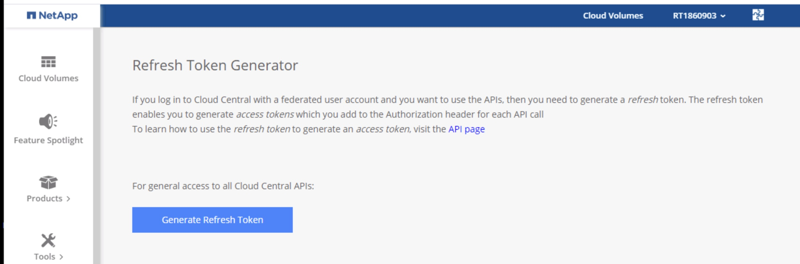
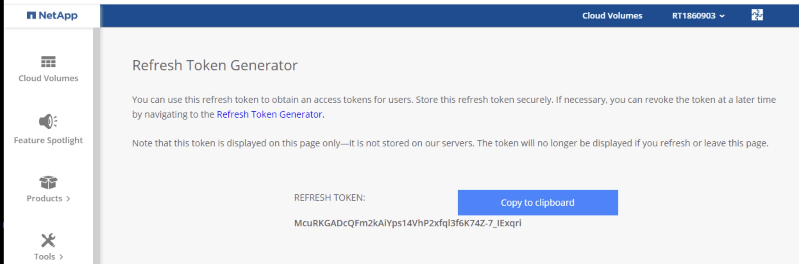
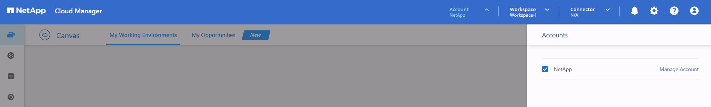
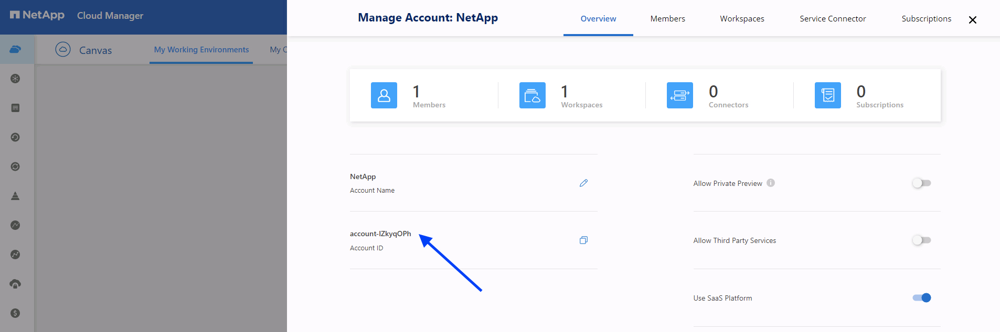
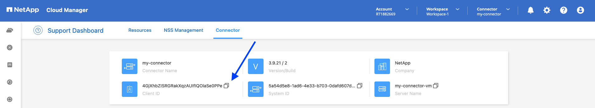

# Cloud Volumes ONTAP on Google Cloud using Terraform

## Cloud Volumes ONTAP Multi Zone using Standalone VPC

It's necessary to install a Cloud Manager Connector virtual machine before to deploy the Cloud Volumes ONTAP instances.

## Cloud Manager Connector

The module parameters and details can be checked in the official documentation:
[NetApp Cloud Manager connector for GCP](https://registry.terraform.io/providers/NetApp/netapp-cloudmanager/latest/docs/resources/connector_gcp).

### Requirements

1. NetApp Cloud Central refresh token.

A refresh token is needed to obtain an access tokens for users. Log in with your credentiales in [https://services.cloud.netapp.com/refresh-token](https://services.cloud.netapp.com/refresh-token) to get the refresh token.

* Click on the generate refresh token button.


* Copy it to the clipboard.


2. Service account for the Cloud Manager Connector.

Create a service account on Google Cloud for the connector as the documentation shows [here](https://docs.netapp.com/us-en/cloud-manager-setup-admin/task-creating-connectors-gcp.html#set-up-a-service-account-for-the-connector). You can use the Google Cloud Shell with the below commands:

```shell
myproject=xxxxxx              # <- Copy your project id here
gcloud config set project $myproject

curl https://occm-sample-policies.s3.amazonaws.com/Policy_for_Cloud_Manager_3.9.10_GCP.yaml -o Policy_for_Cloud_Manager_3.9.10_GCP.yaml

gcloud iam roles create CM_Connector --project=$myproject --file=Policy_for_Cloud_Manager_3.9.10_GCP.yaml

gcloud iam service-accounts create netapp-connector --description="Service account associated with the NetApp Cloud Manager Connector" --display-name="NetApp Connector"

gcloud projects add-iam-policy-binding $myproject --member="serviceAccount:netapp-connector@$myproject.iam.gserviceaccount.com" --role=projects/$myproject/roles/CM_Connector
```

Once you have created the service account, [create a key](https://cloud.google.com/iam/docs/creating-managing-service-account-keys) and download the json file as 'tf-connector.json'.

3. Cloud Manager Account id

* Go to [Cloud Manager SaaS](https://cloudmanager.netapp.com/), and click on the Account menu on the top right. Click on the 'Manage Account' section.



* Copy the Account ID.



### Examples

* [Cloud Manager Connector using Standalone VPC](./examples/01-connector-standalonevpc.md)

## Cloud Volumes ONTAP

The module parameters and details can be checked in the official documentation: [NetApp Cloud Manager CVO for GCP](https://registry.terraform.io/providers/NetApp/netapp-cloudmanager/latest/docs/resources/cvo_gcp).

### Requirements

1. Service account for the Cloud Volumes ONTAP

Create a service account for the CVO instance to be able to tier to GCS and/or backup & restore to GCS. The public [documentation](https://docs.netapp.com/us-en/cloud-manager-cloud-volumes-ontap/task-creating-gcp-service-account.html) shows the steps and required permissions. You can use the Google Cloud Shell with the below commands:

```shell
myproject=xxxxxx              # <- Copy your project id here

gcloud iam service-accounts create cvo-tiering --description="Service account associated with the NetApp Cloud Volumes ONTAP instances" --display-name="NetApp CVO Tiering"

gcloud projects add-iam-policy-binding $myproject --member="serviceAccount: cvo-tiering@$myproject.iam.gserviceaccount.com" --role=roles/storage.admin

gcloud iam service-accounts add-iam-policy-binding cvo-tiering@$myproject.iam.gserviceaccount.com --member='serviceAccount:netapp-connector@$myproject.iam.gserviceaccount.com' --role='roles/iam.serviceAccountUser'
```

2. Cloud Manager Connector Client id

Go to [Cloud Manager SaaS](https://cloudmanager.netapp.com/support-dashboard/connector), and click on the question mark icon on the top right and click on 'Support'. Click on the 'Connector' section. Copy the Client id.



If you are planning to deploy the Connector and the Cloud Volumes ONTAP instances together, you can use the below line instead of look and copy from the console.

```
client_id = netapp-cloudmanager_connector_gcp.cm-gcp.id
```

### Examples

* [Cloud Volumes ONTAP High Availability with a single Persistent Disk using Standalone VPC](./examples/11-cvoha-standalonevpc.md)
* [Cloud Volumes ONTAP High Availability with a single Persistent Disk using Standalone VPC and Tiering](./examples/12-cvoha-standalonevpc.md)
* [Cloud Volumes ONTAP High Availability with a single Persistent Disk using Standalone VPC, Tiering and custom firewall rules](./examples/13-cvoha-standalonevpc.md)
* [Cloud Volumes ONTAP High Availability with multiple Persistent Disks using Standalone VPC, Tiering and custom firewall rules](./examples/14-cvoha-standalonevpc.md)
* [Cloud Volumes ONTAP High Availability with multiple Persistent Disks using Standalone VPC, Tiering, custom firewall rules and Cloud Backup](./examples/15-cvoha-standalonevpc.md)
