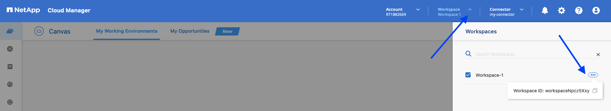

# Cloud Volumes ONTAP High Availability on Google Cloud using Terraform

The module parameters and details can be checked in the official documentation: [NetApp Cloud Manager CVO for GCP](https://registry.terraform.io/providers/NetApp/netapp-cloudmanager/latest/docs/resources/cvo_gcp).

* [Requirements](#requirements)
* [Deployment](#deployment)

## Requirements

### NetApp Cloud Central refresh token

A refresh token is needed to obtain an access tokens for users. Log in with your credentiales in [https://services.cloud.netapp.com/refresh-token](https://services.cloud.netapp.com/refresh-token) to get the refresh token. 

1. Click on the generate refresh token button.


2. Copy it to the clipboard.


### Service account for the Cloud Volumes ONTAP

Create a service account for the CVO instance to be able to tier to GCS and/or backup & restore to GCS. The public [documentation](https://docs.netapp.com/us-en/cloud-manager-cloud-volumes-ontap/task-creating-gcp-service-account.html) shows the steps and required permissions.

### Cloud Manager Connector Client id

1. Go to [Cloud Manager SaaS](https://cloudmanager.netapp.com/support-dashboard/connector), and click on the question mark icon on the top right and click on 'Support'. Click on the 'Connector' section. Copy the Client id.


### Cloud Manager Workspace id

1. Go to [Cloud Manager SaaS](https://cloudmanager.netapp.com/), and click on the workspace section on the top right and click on the three dots. Copy the workspace id.



## Deployment

Check the last Terraform module version and modify the inputs according with your project.

provider.tf
```yaml
terraform {
  required_providers {
    netapp-cloudmanager = {
      source = "NetApp/netapp-cloudmanager"
      version = "22.8.3"
    }
  }
}
```

cvoha.tf
```yaml
provider "netapp-cloudmanager" {
  refresh_token = "E9SgA-0LzUKos5Z7-nx6reey7aypYolF6v_oA5mCIisZV"
}
resource "netapp-cloudmanager_cvo_gcp" "cvo-gcp" {
  provider = netapp-cloudmanager
  name = "cvoha"
  project_id = "rt1882669"
  is_ha = true
  instance_type = "n2-standard-32"
  zone = "us-east4-a"
  node1_zone = "us-east4-a"
  node2_zone = "us-east4-b"
  mediator_zone = "us-east4-cs"
  vpc0_node_and_data_connectivity = "gcp-vpc-core"
  vpc1_cluster_connectivity = "gcp-vpc-cluster"
  vpc2_ha_connectivity = "gcp-vpc-ha"
  vpc3_data_replication = "gcp-vpc-replication"
  subnet0_node_and_data_connectivity = "gcp-vpc-core-private"
  subnet1_cluster_connectivity = "gcp-vpc-cluster-subnet"
  subnet2_ha_connectivity = "gcp-vpc-ha-subnet"
  subnet3_data_replication = "gcp-vpc-replication-subnet"
  gcp_service_account = "storageadmin@rt1882669.iam.gserviceaccount.com"
  svm_password = "Netapp1!"
  license_type = "ha-capacity-paygo"
  capacity_package_name = "Freemium"
  client_id = "4GjXhbZISRGRakXqzAUIfIQOlaSe0PPe"
  workspace_id = "workspaceNpcz5Xxy"
}
```

Run it using the below command:
```shell
terraform apply
```
