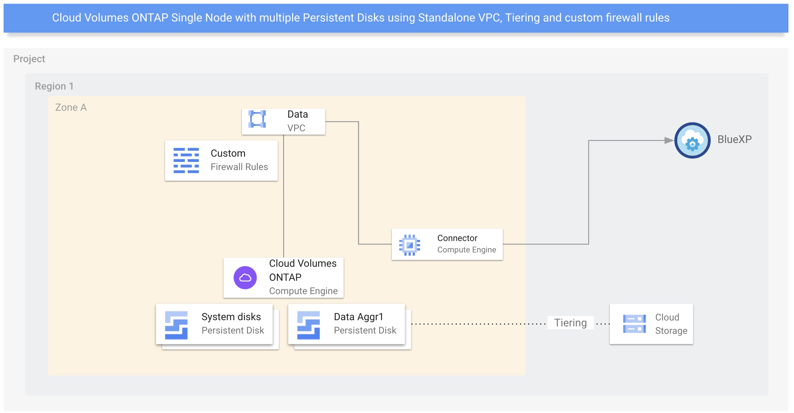

# Cloud Volumes ONTAP on Google Cloud using Terraform

Cloud Volumes ONTAP Single Node with multiple Persistent Disks using Standalone VPC, Tiering and custom firewall rules

## Diagram



## Code

Check the last Terraform module version and modify the inputs according to your project.

my-cvo.tf
```yaml
terraform {
  required_providers {
    netapp-cloudmanager = {
      source = "NetApp/netapp-cloudmanager"
      version = "23.1.1"
    }
  }
}
provider "netapp-cloudmanager" {
  refresh_token = "VZzwMXHb_NTr0nxfwbPMgihFC3KOXe2s71wf6fsXvLPhU"
}

resource "netapp-cloudmanager_cvo_gcp" "cvo-gcp" {
  provider = netapp-cloudmanager
  name = "my-cvo"
  project_id = "my-project"
  zone = "us-east4-b"
  vpc_id = "my-data-vpc"
  subnet_id = "my-data-subnet"
  gcp_service_account = "storageadmin@my-project.iam.gserviceaccount.com"
  svm_password = "********"
  license_type = "capacity-paygo"
  capacity_package_name = "Essential"
  instance_type = "n2-standard-4"
  gcp_volume_type = "pd-ssd"
  gcp_volume_size = 1
  gcp_volume_size_unit = "TB"
  client_id = "4GjXhbZISRGRakXqzCUIfIQOlaSe0PPe"
  capacity_tier = "cloudStorage"
  firewall_rule = "my-custom-fw-rules"
}

resource "netapp-cloudmanager_aggregate" "data-aggregate" {
  provider = netapp-cloudmanager
  working_environment_id = netapp-cloudmanager_cvo_gcp.cvo-gcp.id
  name = "aggr2"
  client_id = "4GjXhbZISRGRakXqzCUIfIQOlaSe0PPe"
  number_of_disks = 2
  provider_volume_type = "pd-ssd"
}
```

Run it using the below command:
```shell
terraform apply
```
