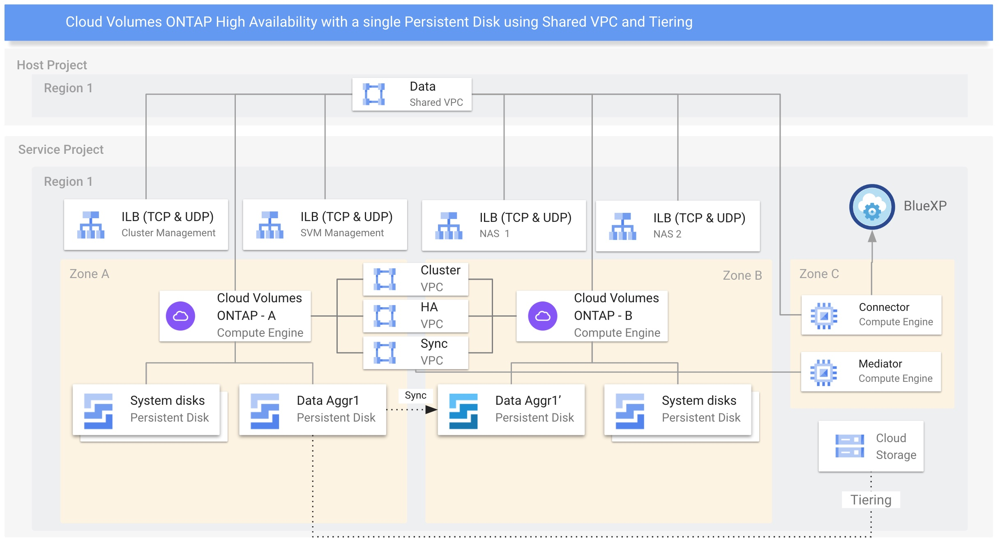

# Cloud Volumes ONTAP on Google Cloud using Terraform

Cloud Volumes ONTAP High Availability with a single Persistent Disk using Shared VPC and Tiering

## Diagram



## Code

Check the last Terraform module version and modify the inputs according to your project.

my-cvo.tf
```yaml
terraform {
  required_providers {
    netapp-cloudmanager = {
      source = "NetApp/netapp-cloudmanager"
      version = "22.12.0"
    }
  }
}
provider "netapp-cloudmanager" {
  refresh_token = "VZzwMXHb_NTr0nxfwbPMgihFC3KOXe2s71wf6fsXvLPhU"
}

resource "netapp-cloudmanager_cvo_gcp" "cvo-gcp" {
  provider = netapp-cloudmanager
  name = "my-cvo"
  project_id = "my-service-project"
  is_ha = true
  zone = "us-east4-b"
  node1_zone = "us-east4-a"
  node2_zone = "us-east4-b"
  mediator_zone = "us-east4-c"
  vpc0_node_and_data_connectivity = "my-data-vpc"
  vpc1_cluster_connectivity = "my-cluster-vpc"
  vpc2_ha_connectivity = "my-ha-vpc"
  vpc3_data_replication = "my-replication-vpc"
  subnet0_node_and_data_connectivity = "my-data-subnet"
  subnet1_cluster_connectivity = "my-cluster-subnet"
  subnet2_ha_connectivity = "my-ha-subnet"
  subnet3_data_replication = "my-replication-subnet"
  gcp_service_account = "storageadmin@my-project.iam.gserviceaccount.com"
  svm_password = "********"
  license_type = "ha-capacity-paygo"
  capacity_package_name = "Essential"
  instance_type = "n2-standard-4"
  gcp_volume_type = "pd-ssd"
  gcp_volume_size = 1
  gcp_volume_size_unit = "TB"
  client_id = "4GjXhbZISRGRakXqzCUIfIQOlaSe0PPe"
  network_project_id = "my-host-project"
  capacity_tier = "cloudStorage"
}
```

Run it using the below command:
```shell
terraform apply
```
