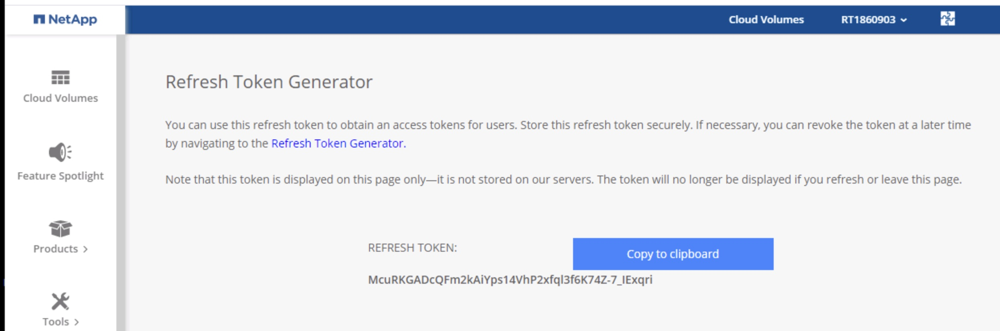

# Volume on Google Cloud using Terraform

The module parameters and details can be checked in the official documentation: [NetApp Cloud Manager Volume](https://registry.terraform.io/providers/NetApp/netapp-cloudmanager/latest/docs/resources/cvo_volume).

* [Requirements](#requirements)
* [Deployment](#deployment)

## Requirements

### NetApp Cloud Central refresh token

A refresh token is needed to obtain an access tokens for users. Log in with your credentiales in [https://services.cloud.netapp.com/refresh-token](https://services.cloud.netapp.com/refresh-token) to get the refresh token. 

1. Click on the generate refresh token button.


2. Copy it to the clipboard.



### Cloud Manager Connector Client id

1. Go to [Cloud Manager SaaS](https://cloudmanager.netapp.com/support-dashboard/connector), and click on the question mark icon on the top right and click on 'Support'. Click on the 'Connector' section. Copy the Client id.


### Cloud Manager Working Environment id

1. Go to [Cloud Manager SaaS](https://cloudmanager.netapp.com/), select the deployed Cloud Volumes ONTAP instance anc click on 'Enter Working Environment'.


2. Click in the Information section.


3. Copy the working environment id. 


## Deployment

Check the last Terraform module version and modify the inputs according to your project.

provider.tf
```yaml
terraform {
  required_providers {
    netapp-cloudmanager = {
      source = "NetApp/netapp-cloudmanager"
      version = "22.8.3"
    }
  }
}
```

vol.tf
```yaml
provider "netapp-cloudmanager" {
  refresh_token = "E9SgA-0LzUKos5Z7-nx6reey7aypYolF6v_oA5mCIisZV"
}
resource "netapp-cloudmanager_volume" "cvo-volume-nfs" {
  provider = netapp-cloudmanager
  volume_protocol = "nfs"
  name = "vol1"
  size = 10
  unit = "GB"
  provider_volume_type = "pd-standard"
  export_policy_type = "custom"
  export_policy_ip = ["0.0.0.0/0"]
  export_policy_nfs_version = ["nfs4"]
  aggregate_name = "aggr2"
  capacity_tier = "none"
  working_environment_id = "vsaworkingenvironment-ycnwkjrk"
  client_id = "4GjXhbZISRGRakXqzAUIfIQOlaSe0PPe"
}
```

Run it using the below command:
```shell
terraform apply
```
